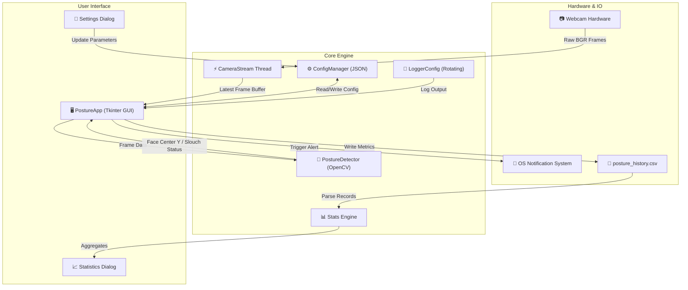

# 🧘 PostureGuard

<div align="center">

[](https://www.python.org/)
[](https://opencv.org/)
[](https://docs.python.org/3/library/tkinter.html)
[](LICENSE)
[](CHANGELOG.md)

**An intelligent, lightweight, real-time desktop application designed to monitor your posture using Computer Vision, helping you prevent slouching and maintain ergonomics while working.**

[Features](#-key-features) • [Architecture](#-system-architecture) • [Installation](#-installation--setup) • [User Guide](#-user-guide--keyboard-shortcuts) • [Exception Taxonomy](#-exception--diagnostic-system) • [Testing](#-unit-test-suite)

</div>

---

## 📖 Overview

**PostureGuard** is a private, local-first "digital health coach" that runs unobtrusively in your system tray or background. Utilizing your webcam and CPU-efficient Computer Vision algorithms (OpenCV Haar Cascade Classifiers), PostureGuard establishes a baseline for your healthy sitting position and provides instant visual and desktop notifications whenever bad posture or sustained slouching is detected.

Unlike heavy deep-learning solutions, **PostureGuard** relies on an optimized OpenCV pipeline, custom moving-average coordinate smoothing queues, multithreaded frame capture, and an asynchronous Tkinter dashboard to deliver zero latency at **30+ FPS** without draining CPU or GPU resources.

> [!IMPORTANT]
> **Privacy First Guarantee**: 100% of video processing occurs locally on your machine in real-time. No video feeds, images, telemetry, or personal metrics are ever saved to disk or transmitted over a network.

---

## ✨ Key Features

- 🎥 **Real-Time Head & Posture Tracking**
  Calculates vertical face center displacement at up to 30 FPS using local OpenCV Haar Cascade feature extraction.
- ⚡ **Multithreaded Camera Engine (`CameraStream`)**
  Runs webcam capture loops on a decoupled background daemon thread to eliminate UI stuttering, frame drops, and input blocking on the Tkinter main loop.
- 🎯 **Persistent Baseline Calibration**
  Calibrates and saves your custom ergonomic vertical coordinate baseline to local JSON configuration, allowing seamless continuity across sessions.
- 🛡️ **Smooth Moving Average Buffer**
  Filters out micro-movements, head tilts, and temporary jitter using a double-ended smoothing queue (`deque`).
- 🔔 **Multi-Channel Alert System**
  - **Dynamic Visual Status:** Canvas overlay borders and status indicators change from **Green (Good Posture)** to **Red (Slouching Detected)**.
  - **Desktop Toast Notifications:** System notifications alert you when poor posture persists beyond configurable frame thresholds.
- 📊 **Analytics & Session Statistics Engine**
  Tracks session metrics and logs timestamped deviation entries to `posture_history.csv`, offering built-in aggregate statistics calculation (good vs. slouch percentage, average pixel deviation).
- ⚙️ **Dynamic Runtime Settings Dialog**
  Adjust webcam device index, camera resolution, slouch pixel threshold (5px–500px), alert delay frames, and frame refresh rates live inside the app.
- 🧰 **Enterprise Diagnostic Exception Hierarchy**
  Includes over 100+ fine-grained custom exception subclasses inheriting from `PostureGuardException` for bulletproof error tracing across audio, video, UI, logger, CSV, and config subsystems.

---

## 🏗️ System Architecture

PostureGuard is built on a modular, decoupled architecture ensuring clean separation between frame acquisition, computer vision processing, state management, UI rendering, and persistent storage.



---

## 📁 Repository Structure

```text
PostureGuard/
│
├── assets/                 # Application branding, window icons (PNG/ICO)
├── tests/                  # Automated unit test suite
│   ├── test_config_manager.py
│   ├── test_exceptions.py  # 140+ custom exception taxonomy unit tests
│   ├── test_logger_config.py
│   ├── test_posture_detector.py
│   └── test_stats.py
│
├── config_manager.py       # Configuration reader, writer, and validator (config.json)
├── exceptions.py           # Comprehensive custom application exception hierarchy
├── logger_config.py        # Centralized rotating file and console logger module
├── main.py                 # Main application entry point, GUI layout & CameraStream thread
├── posture_detector.py     # OpenCV face detection, smoothing queue, and calibration engine
├── stats.py                # History CSV parser and aggregate metrics generator
│
├── config.json             # Local active settings storage (auto-generated)
├── config.json.default     # Baseline default settings template
├── CHANGELOG.md            # Complete version history and release notes
├── CONTRIBUTING.md         # Guidelines for project contributors
├── LICENSE                 # Open-source MIT License
├── pyproject.toml          # Build configuration and project metadata
├── requirements.txt        # Python library dependencies
├── run.bat                 # Windows execution script
└── run.sh                  # macOS/Linux execution script
```

---

## 💻 Installation & Setup

### Prerequisites
- **Python 3.10** or higher
- A connected USB or built-in webcam
- Windows, macOS, or Linux OS with display server support

### Step 1: Clone the Repository
```bash
git clone https://github.com/Dharm3112/PostureGuard.git
cd PostureGuard
```

### Step 2: Set Up Virtual Environment (Recommended)
```bash
# Create virtual environment
python -m venv .venv

# Activate on Windows (PowerShell):
.venv\Scripts\Activate.ps1

# Activate on macOS / Linux:
source .venv/bin/activate
```

### Step 3: Install Dependencies
```bash
pip install --upgrade pip
pip install -r requirements.txt
```

---

## 🎮 User Guide & Keyboard Shortcuts

### Launching the Application
- **Windows:** Double-click `run.bat` or execute:
  ```powershell
  python main.py
  ```
- **macOS / Linux:** Execute `run.sh` or run:
  ```bash
  python main.py
  ```

### Step-by-Step Workflow
1. **Initial Calibration:**
   Sit up straight in your ideal ergonomic position facing your camera. Click **"Sit Straight & Calibrate"** (or press `Ctrl+L`). The application will record your center vertical height baseline ($Y_{\text{baseline}}$).
2. **Real-Time Monitoring:**
   As you work, PostureGuard continuously computes your face center position ($Y_{\text{current}}$). If $Y_{\text{current}} > Y_{\text{baseline}} + \text{threshold}$, the app registers a slouch state.
3. **Alerts & Notifications:**
   If slouching persists for longer than the alert frame limit (default: 50 frames), a system notification pops up to remind you to straighten your back.
4. **Pause / Resume:**
   Click **"Pause"** when stepping away for a break, and click **"Resume"** to restart posture detection.
5. **View Session Analytics:**
   Click **"Stats"** to review your good posture percentage, total slouch count, and average deviation.

### ⌨️ Keyboard Shortcuts
| Shortcut | Action |
| :--- | :--- |
| `Ctrl + L` | Instant Baseline Calibration |
| `Ctrl + C` | Safely Terminate & Exit Application |

---

## ⚙️ Configuration File (`config.json`)

Settings can be customized directly in the application GUI via **Settings**, or manually by modifying `config.json`:

```json
{
  "camera_index": 0,
  "camera_width": 640,
  "camera_height": 480,
  "slouch_threshold_px": 40,
  "time_to_alert_frames": 50,
  "frame_delay_ms": 15,
  "save_history": true,
  "saved_baseline_y": 142.5,
  "scale_factor": 1.1,
  "min_neighbors": 5,
  "log_max_bytes": 1048576,
  "log_backup_count": 3
}
```

---

## 🧰 Exception & Diagnostic System

PostureGuard features an extensive, strongly-typed custom exception taxonomy. All application exceptions derive from `PostureGuardException`, providing standard error codes and descriptive messages for accurate diagnostics.

```text
PostureGuardException (Base Exception)
 ├── CameraError
 │    ├── CameraStreamError
 │    ├── CameraFPSBoundsError
 │    └── CameraUnsupportedResolutionError
 ├── ModelLoadError
 │    ├── ModelCascadeParseError
 │    └── ModelCascadeCorruptFileError
 ├── ConfigError
 │    ├── ConfigKeyMissingError
 │    └── ConfigReadOnlyViolationError
 ├── AudioError
 │    ├── AudioOutputDeviceMutedError
 │    └── AudioCodecUnsupportedError
 └── StatsError
      ├── CSVHeaderLengthMismatchError
      └── StatsDataTimestampInvalidFormatError
```

---

## 🧪 Unit Test Suite

PostureGuard comes with an automated unit test suite covering configuration management, exception mappings, logger initialization, posture detection smoothing algorithms, and CSV statistics calculations.

Run the test suite with Python's built-in `unittest` module:

```bash
python -m unittest discover -s tests
```

---

## 🤝 Contributing

Contributions are welcome! If you would like to report a bug, suggest a feature, or submit code changes:

1. Fork the repository
2. Create your feature branch (`git checkout -b feature/AmazingFeature`)
3. Commit your changes (`git commit -m 'Add some AmazingFeature'`)
4. Push to the branch (`git push origin feature/AmazingFeature`)
5. Open a Pull Request

Please review [CONTRIBUTING.md](CONTRIBUTING.md) for details.

---

## 📜 License

Distributed under the **MIT License**. See `LICENSE` for more information.

<div align="center">

**PostureGuard** • Prioritize your spinal health with Computer Vision.

</div>
